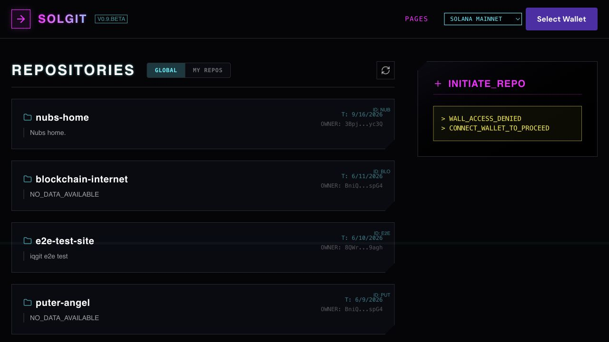
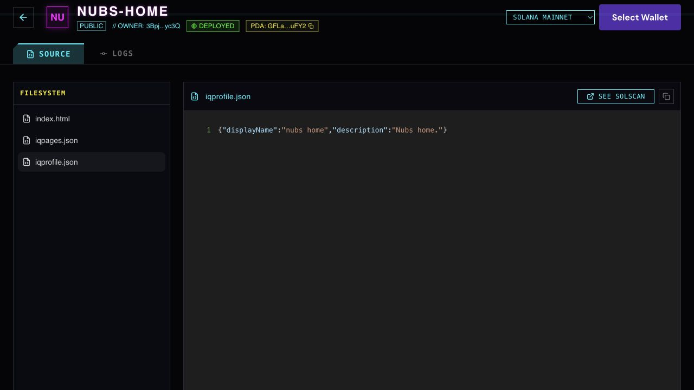
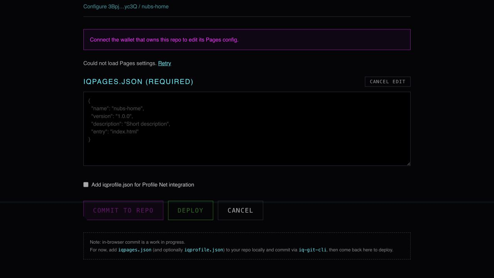
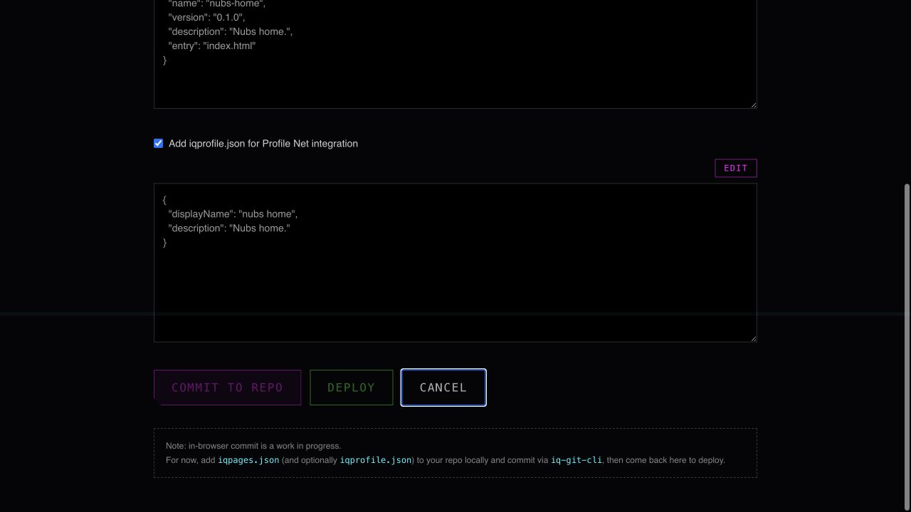

# Combined IQ Git browser verification

2026-09-16. Read-only browser checks against existing mainnet Nubs Home data, using a local production build with PRs #7, #8 and #9 merged together.

## Exact code tested

- #7: f5f20290524c1ff35e12285f8781f6d2606593ce
- #8: a0627a8026fc52635181077bc3d7dcd25f4504ac
- #9: 8f72f5089434e0f32f385a14cc1c330d302b1c70
- Local integration HEAD: 0e9f69fb55385f795464cf7e4b0176575dc00104. Both ordinary merges were clean.
- Production build passed with NEXT_PUBLIC_SOLANA_MAINNET_RPC_URL=https://api.mainnet-beta.solana.com. Served at 127.0.0.1:4355.

## Real-app results

- The global gallery rendered 11 cards with 11 unique repository URLs. Nubs Home opened from its card.
- Nubs Home showed DEPLOYED and its three files: index.html, iqpages.json and iqprofile.json. Selecting the profile file showed its actual on-chain contents. Logs showed the original file commit and subsequent Pages configuration commit.
- Pages setup initially showed Loading Pages settings with disabled controls. After both reads completed, the two existing JSON files appeared locked, and Profile Net was checked.
- Browser DevTools temporarily blocked only the existing profile blob URL. The actual SDK/query path failed and displayed Could not load Pages settings plus Retry; controls stayed disabled. No replacement response or fabricated chain data was injected.
- Removing the block and clicking Retry restored both published JSON files, their read-only state and the checked Profile Net option.
- Following the repository link and navigating Back preserved the settings. Editing the profile JSON locally and cancelling restored the published value and locked it again.
- The captured successful repository/config/profile requests used gateway.iqlabs.dev and returned HTTP 200. Browser warning/error logs were empty in the collected snapshot. Temporary network blocking was removed before finishing.

## Limits

This is real app and gateway read-path evidence, not another wallet publishing run. No wallet connection, signature, payment, deployment or inscription was submitted. Post-commit stale-cache behavior remains covered by the controlled component/React Query checks in ../pages-state/README.md. This integration run does not validate transaction submission through the configured RPC, EVM publishing, upstream deployment, or backend cache propagation. The four previously documented baseline lint errors remain outside this check.

## Screenshots

