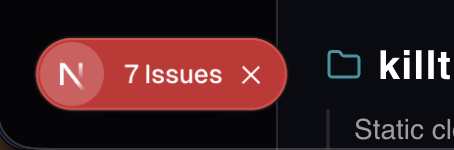
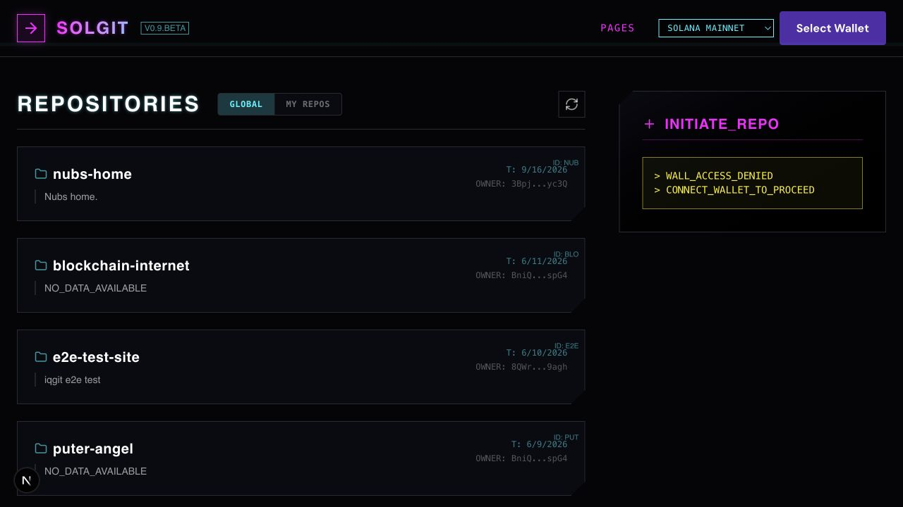
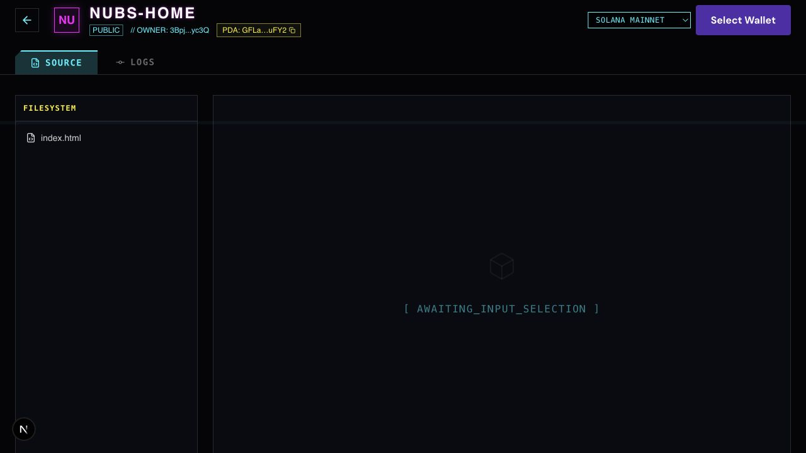

# Repository gallery rendering QA

Base: 6a5d1bb. Real gateway data, local browser; no test posts or transactions.

The existing page reported invalid html/section nesting from the toast provider and repeated duplicate-key errors for blockchain-internet. Switching to My Repos could leave the duplicate card behind. A separate WebSocket error came from the local publishing RPC relay, not these rendering fixes.

Providers now render inside body. The gallery retains the first row for each owner/repo in the reader's order before filtering/pagination, so duplicate registry rows do not produce duplicate React keys.

Repository loading also used Math.random() for placeholder widths. A fresh Nubs Home repository load reproduced server/client style mismatches. Those widths are now deterministic. The same repository route on the fixed local build loads with no browser console errors, using real gateway data. This is a rendering check, not proof of site deployment.

Verified: one blockchain-internet card, no console errors on fresh load; TypeScript, changed-file ESLint, production build, and git diff --check pass. Wallet signing and deployed-site acceptance are not claimed by this PR.

Baseline npm ci fails because bufferutil is absent from the upstream lockfile. Local installation used npm install --ignore-scripts --package-lock=false, without editing the lockfile.

