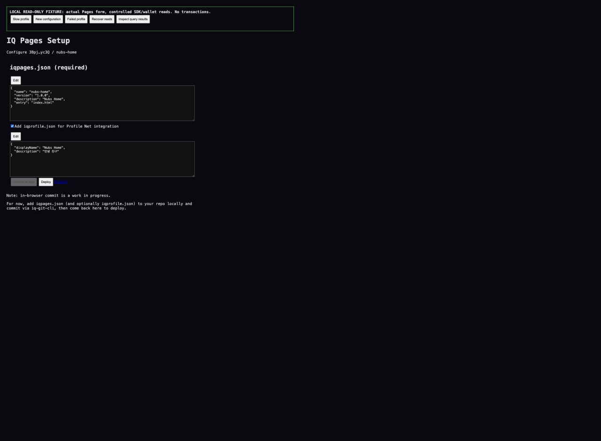
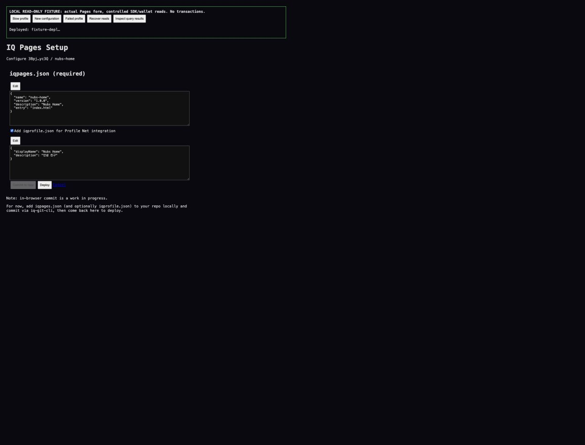

# Pages settings regression checks

2026-09-16. Base: 6a5d1bb. The two failures were observed while publishing Nubs Home: settings remained stale after a successful commit, and the Profile Net checkbox initialized before its slower file read completed.

This fix waits for both configuration reads, blocks editing while initialization or a commit is pending, and offers Retry when an initial read fails. Repository/network changes reset the form. Repository invalidation now covers Pages configuration/profile and latest-tree queries. After a successful Pages commit, the exact committed configuration and tree ID seed the query cache after refetch completes, so a stale gateway read cannot leave Deploy checking the old configuration.

## Browser checks

A local fixture bundles the actual Pages component and the actual useInvalidateRepo function with React Query. Wallet, SDK commit/deploy, network context and query responses are controlled fixtures. This is not a new signed publishing test. No requests to wallets, payments, posts or inscriptions were made.

- Config resolves first; profile resolves two seconds later. The form stays disabled while waiting, then the existing profile checkbox is checked and Korean profile text is present and locked.
- Both reads return null. Entering a valid configuration and completing the fixture commit seeds the new config and tree despite the refetch still returning null. Deploy passes its configuration guard to the fixture service.
- A failed profile read keeps the form disabled and displays Retry. After recovery, Retry populates and locks both existing files.

The fixture uses plain diagnostic styling. Screenshots show the actual form's behavior, not production visual acceptance or a real wallet transaction.

## Checks and limitations

- Production build passed.
- TypeScript noEmit passed.
- git diff --check passed.
- Focused ESLint reports the same four errors on the base and patch: three pre-existing set-state-in-effect diagnostics and an unescaped apostrophe. Lint is not reported as passing.
- Existing live Nubs Home remained accessible on its published URL.
- Real wallet commit/deploy, EVM publishing, and backend gateway cache propagation were not rerun for this patch. This fixes the frontend's state after confirmed writes, not the gateway cache implementation.
